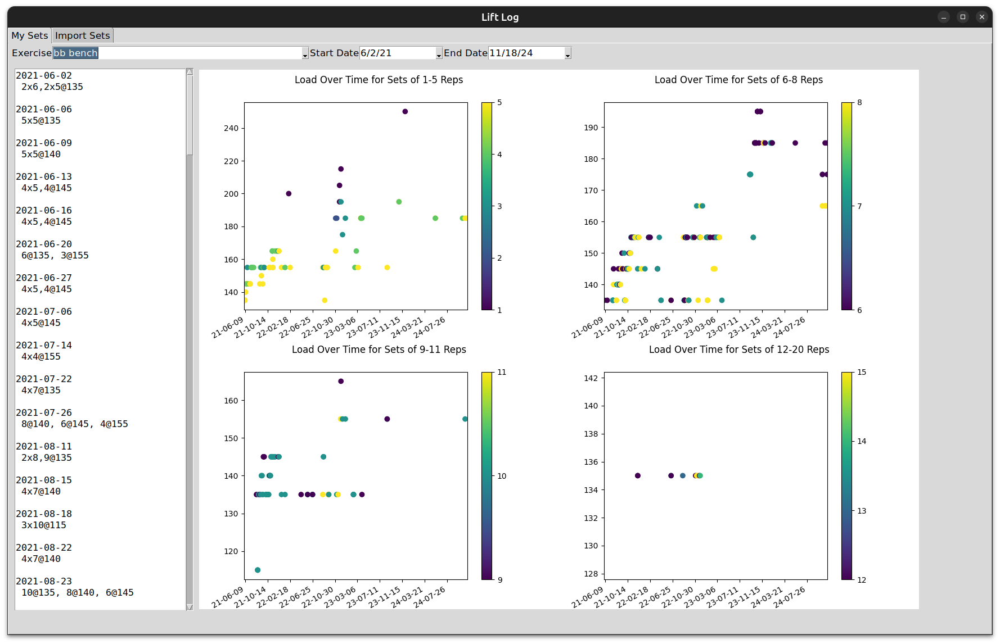
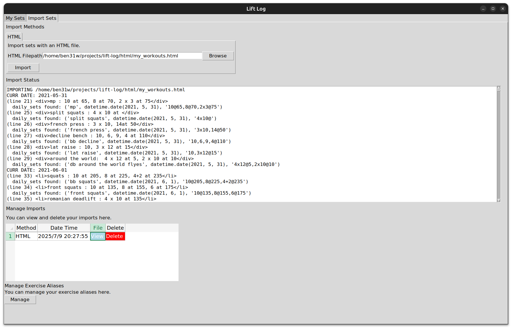

# Lift Log

Lift Log enables you to visualize your exercise sets and progress at the gym.
You can import your exercise sets directly from Apple Notes. Lift Log reads 
your notes, finds exercises, and generates progress plots for each exercise.

## How it works

### Import Sets

Exercise sets must be imported via an HTML file or Apple Notes.
The `html` directory contains example HTML files that can be imported.

In order to detect exercise sets, they must follow a specific syntax:
- exercise: Reps,SetxReps@Weight, SetxReps,~Reps@AnotherWeight, ...
- exercise: Reps,SetsxReps,~Reps  (no weight)

Examples: 
- bench press: 2x10@135, 2x8@145, ~5@155
- pull ups: 10,2x8,~7

You can also have comments at the end of each line that will be ignored.
'~' is an acceptable syntax that indicates partial reps.

If importing from Apple Notes, there are a few interchangeable characters: 
- ':' and '-'
- ',' and ';'
- '@' and ' at '

## My Sets

Once you have imported some exercise sets, you can view progress plots for any
exercise. Each exercise is given four scatter plots:
- Load over time for sets with 1-5 reps
- Load over time for sets with 6-8 reps
- Load over time for sets with 9-11 reps
- Load over time for sets with 12+ reps

## Setup + Running

Prerequisite: Python 3.10+

The app isn't neatly packaged (yet). The ideal way to set up the app is:
1. Clone the project.
2. Create virtual environment. `python -m venv .venv`
3. Activate virtual environment. `source .venv/bin/activate`
4. Install dependencies. `pip install -r requirements.txt`

Once set up, the ideal way to run the app is:
1. Activate virtual environment. `source .venv/bin/activate`
2. `python src/app.py`

## Inspiration

Since 2021, I've used my phone to jot down my exercise sets. I have several 
years of personal exercise data in Apple Notes. But Apple Notes isn't great for
visualizing progressive overload/progress over time :/

To solve this problem, I started developing an app that could ingest 
exercise data from Apple Notes and produce appealing visualizations. I'm not 
sure how useful of a fitness tool this will end up being. But the project 
combines my passions for fitness and programming, and I've enjoyed it a lot
so far. 

## TODOs with (PRIORITY) (ESTIMATED TIME REQUIRED)
- (MEDIUM) (4 hours) Package the app + dependencies into an executable.
- (MEDIUM) (<1 hr) Add functionality to the date entries for Apple Notes imports
- (MEDIUM) (8 hrs) Make the progress plots more appealing.
  - Plotly is better for interactive plots. Matplotlib was chosen for simplicity
    and easy integration with Tkinter. Plotly charts probably need to be embedded
    in a webpage to appear in Tkinter. But it could be worth it.
  - Add best-fit lines.
  - The plots don't look great when the window resizes, especially on small 
    resolution screens. The fonts on the plots don't resize. This might fix itself
    if we switch to Plotly.
- (MEDIUM) (2 hrs) A tab/some sort of view for all sets, date organized. Could be a
    a simple SQLite retrieval + display
- (LOW) (UNK) On macOS: mouse scroll doesn't work on Import Sets tab
- (LOW) (UNK) Import sets by processing images. This seems very advanced.
- (LOW) (UNK) Containerize this app. Apparently, this is difficult for 
  Tkinter/GUI apps. It could solve the requirement for Python 3.10+ and 
  macOS for Apple Notes imports.